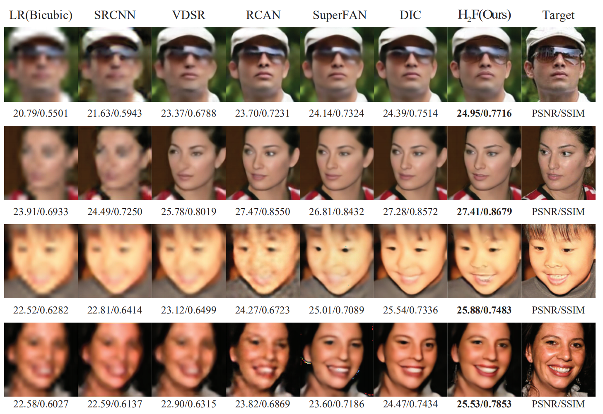

# H2F-FaceSR
## Visual Results
<p align="center">
  
</p>

## Dependencies
- Python 3
- [Tensorflow >= 2.1.0]
- Python packages: `pip install numpy opencv-python matplotlib`
## Testing
To generate SR images by a model:
```python
python H2F.py
```
- The configurations should be modified in the json file `option.json`.
- Before running this code, please modify option file to your own configurations including: 
  - proper `HR_img_path` and `LR_img_path` paths for the LR and HR data
  - proper `shape_priors_path` for the shape priors
  - proper `pretrained_model_path` for the pretrained model. 
  - proper `SR_image_path` for the output SR images and the PSNR and SSIM results
  - whether to use gpu
  - other hyperparameters
 - PSNR and SSIM results will be in `/path/to/result/images/result.json`.
